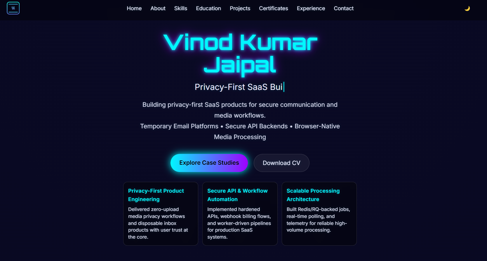

# Vinod Kumar Jaipal Portfolio

Modern responsive portfolio website focused on full-stack engineering, SaaS product work, and privacy-first web experiences.

## Live Website

- https://vinodkumarjaipal.github.io/

## Preview Screenshot

## Pre-Push Checklist

- Verify all links open correctly (GitHub, LinkedIn, project live links)
- Open site once on mobile + desktop view
- Confirm contact form opens email client on submit (GitHub Pages static flow)
- Ensure screenshot renders correctly in this README on GitHub

## Highlights

- Responsive layout for desktop, tablet, and mobile
- Dark/Light theme support
- Animated loader and section reveal effects
- Professional sections: About, Skills, Education, Projects, Certificates, Experience, Contact
- SEO-ready metadata (Open Graph, Twitter tags, structured data)

## Tech Stack

- HTML5
- CSS3
- Vanilla JavaScript

## Project Structure

- index.html
- assets/css/
- assets/js/
- assets/images/

## Run Locally

1. Open the project in VS Code.
2. Start a local server (recommended: Live Server extension).
3. Open index.html through localhost.

## Contact

- Email: vinodkumarjaipal234@gmail.com
- GitHub: https://github.com/vinodkumarjaipal
- LinkedIn: https://www.linkedin.com/in/vinod-kumar-jaipal/
